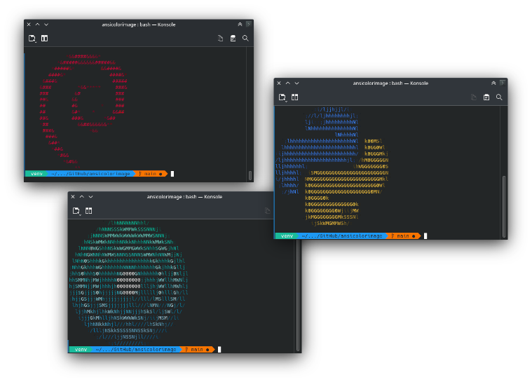
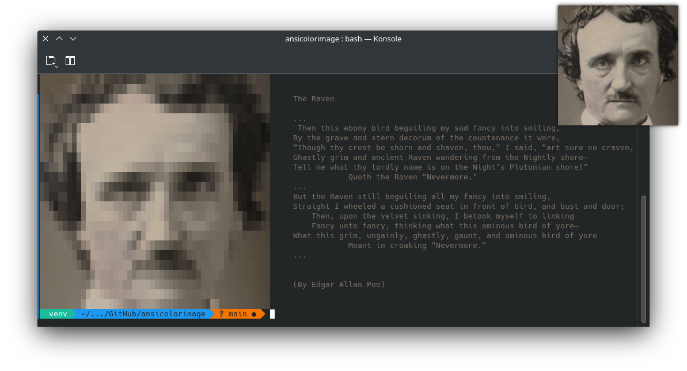
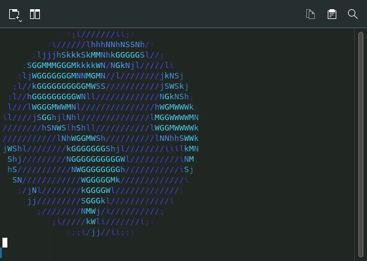

# AnsiColorImage
Python lib to create figures with text characters and ANSI colors from an image file 


https://github.com/w-a-gomes/ansicolorimage

### Minimal example.

```python
img = AnsiColorImage(url_image='python.png')
for line in img.ansi_lines:
    print(line)
```


### Definition
Use `help()` for details.
```
AnsiColorImage:
    Parameters:
        url_image
    
    Optional parameters:
        brightness
        chars_map
        contrast
        height
        hide_foreground_character
        show_background_color
        width

    Properties:
        ansi_lines
        brightness
        chars_map
        contrast
        height
        hide_foreground_character
        image_accent_color
        show_background_color
        url_image
        width
    
    Methods:
        update_ascii_lines
        
```

### Easy handling
Each item represents a line, making it easy to enter parallel information.
I will also use the accent color to color the text with a vintage look, just like the image.

```python
poem = """
    
The Raven

...
 Then this ebony bird beguiling my sad fancy into smiling,
By the grave and stern decorum of the countenance it wore,
“Though thy crest be shorn and shaven, thou,” I said, “art sure no craven,
Ghastly grim and ancient Raven wandering from the Nightly shore—
Tell me what thy lordly name is on the Night’s Plutonian shore!”
            Quoth the Raven “Nevermore.”
...
But the Raven still beguiling all my fancy into smiling,
Straight I wheeled a cushioned seat in front of bird, and bust and door;
    Then, upon the velvet sinking, I betook myself to linking
    Fancy unto fancy, thinking what this ominous bird of yore—
What this grim, ungainly, ghastly, gaunt, and ominous bird of yore
            Meant in croaking “Nevermore.”
...


(By Edgar Allan Poe)

"""
img = AnsiColorImage(
    url_image='poe.jpg',
    height=25,
    width=50,
    show_background_color=True,
    hide_foreground_character=True)

for text_line, img_line in zip(poem.split('\n'), img.ansi_lines):
    print(
        img_line,
        f'\x1b[38;2;{img.image_accent_color}m{text_line}\x1B[0m')
        # See how to format colors -> https://github.com/termstandard/colors
```


### Custom character map

Choosing the character map helps to achieve conceptual aesthetic results. For example, using 0 and 1 alluding to hacking.
Work with a gradient of around **20** characters.

```python
img = AnsiColorImage(
        url_image='bin.png',
        height=20,
        width=80,
        contrast=1.2,
        brightness=0.95,
        chars_map=['0', '0', '0', '0', '0'] + ['1'] * 15)
    for line in img.ansi_lines:
        print(line)
```


### Make an animation

```python
img_frames = os.listdir('image-frames/')  # import os
img_frames.sort()  # ['1.png', '2.png', '3.png', '4.png', '5.png', '6.png']

images = [
    AnsiColorImage(url_image='wifi-images/' + x, height=25, width=85)
    for x in img_frames]

for image in images * 5:
    time.sleep(0.2)     # import time
    os.system('clear')  # import os
    
    for line in image.ansi_lines:
        print(line)
```

